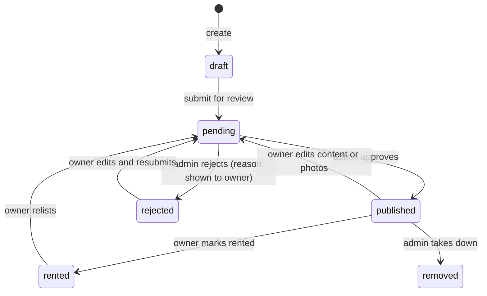
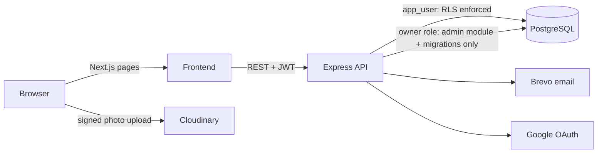

# RooMates

[](https://github.com/Kamran4074/rooMates/actions/workflows/ci.yml)

**Split rent and bills with roommates, and find a room or flatmate near you.**

RooMates has two halves:

1. **Expense rooms.** Create a room for your flat or a trip, add shared expenses (split equally or custom), collect money upfront into a kitty (settled fairly when it closes), and see who owes whom. A debt-simplification algorithm keeps settle-up to the fewest payments.
2. **Room listings.** Post a spare room or bed. A moderator approves it, people find it by city, filters or "near me", send an "I'm interested" request, and contact details are shared only after the owner accepts.

It's a modular monolith: one Express API, one Postgres database. The focus is on the parts that are easy to get wrong: data isolation, authorization, money arithmetic and abuse protection.

## Contents

- [Features](#features)
- [Tech stack](#tech-stack)
- [Architecture](#architecture)
- [Frontend](#frontend)
- [User roles and authorization](#user-roles-and-authorization)
- [Database overview](#database-overview)
- [Authentication flow](#authentication-flow)
- [Security checklist](#security-checklist)
- [API](#api)
- [Local setup](#local-setup)
- [Scripts](#scripts)
- [Tests](#tests)
- [Deployment](#deployment)
- [Troubleshooting](#troubleshooting)
- [Future improvements](#future-improvements)

---

## Features

**Accounts**
- Email + password (OTP-verified email, forgot/reset via emailed code) or "Continue with Google"
- Short-lived JWT access token + rotated, hashed refresh token
- A unique Indian mobile number is required, to stop people farming free rooms with throwaway emails

**Expense rooms**
- Rooms for flatmates or trips, joined with an invite code that only the room admin can see or reset
- The admin can remove members (only once they're settled up; the invite code rotates automatically)
- Record who actually paid (you or any member) and the day it was spent, so a bill added late still lands in the right month
- Equal or custom splits, live balances, and a settle-up plan with at most *n − 1* payments
- **Settle up for real:** "Mark as paid" on a suggested payment (or record any payment) and the balances update. One of the two people or the room admin records it
- Delete a wrong expense or payment (whoever added it, or the room admin). It's a soft delete: the record stays with who deleted it and when
- Room fund ("kitty"): ₹X per person paid upfront to one collector, partial payments, spending from the pool. Payments a member records themselves count only after the collector confirms them. Closing the fund settles the leftover so everyone paid an equal share of what was spent
- Monthly expenses view and month-by-month history across rooms

**Room listings**
- Owners: create (draft) → add photos → submit for review → live → mark rented / relist
- Search by city, pincode, rent range, room type, furnishing and availability, with pagination
- "Near me": browser location → listings within a radius, nearest first
- "I'm interested" requests: owner accepts or declines; accepting can also mark the room rented
- Report a listing (fake, wrong info, already rented, spam)

Listing lifecycle:



Business rules worth knowing: the free plan allows 2 created rooms per account; at most 5 active listings per account; listing photos are limited to 6 (JPG/PNG/WebP, under 5 MB); a member can only be removed from a room once their balance is zero; each user can request and report a listing once; a fund can never be spent below zero, and its participants are fixed when it starts (someone joining the room later isn't asked to pay).

**Super admin**
- Dashboard counts, review queue (approve / reject with a reason the owner sees), take-downs
- Reports: dismiss, resolve, or remove the listing
- Suspend / restore accounts (ends their sessions)
- Read-only view of any expense room, for support
- Break-glass account from the environment: `SUPER_ADMIN_EMAIL` / `SUPER_ADMIN_PASSWORD` are applied on every start, so a forgotten admin password is fixed by changing the env value and redeploying
- Audit log of every admin action

## Tech stack

| Layer | Tools |
|---|---|
| Frontend | Next.js 16 (App Router), React 19, TypeScript, Tailwind CSS v4, Zustand, lucide-react |
| Backend | Node.js, Express 5, TypeScript, Zod, Winston + Morgan |
| Database | PostgreSQL (Neon), Row-Level Security, node-pg-migrate (raw SQL via `pg`, no ORM) |
| Auth | JWT + rotated refresh tokens, bcrypt, Google OAuth (token verified with Google), email OTP |
| Services | Brevo (email), Cloudinary (listing photos, signed direct upload) |
| Security | Helmet, express-rate-limit, express-slow-down, CORS allow-list |
| Docs & tests | OpenAPI generated from the Zod schemas + Swagger UI, Jest (unit + API integration) |

## Architecture



Inside the API every module follows the same layers:

```
Route        URL + middleware (authenticate, authorize) -> controller. No logic.
  ↓
Controller   parse & validate input (Zod), call the service, send the response
  ↓
Service      business rules: ownership, status transitions, transactions
  ↓
Repository   SQL (only where queries are shared, e.g. rooms.repository, listings.repository)
  ↓
PostgreSQL   Row-Level Security as the last line of defence
```

```
Backend/
  src/
    app.ts, index.ts            app wiring; startup runs pending migrations, graceful shutdown
    config/                     env (validated), db pools, logger, email, image storage, OpenAPI
    middlewares/                authenticate, authorize(role), errorHandler, rate limits, request log
    utils/                      response envelope, pagination, money, validation
    modules/
      auth/        users/       sign-up/in, OTP, tokens, profile
      rooms/       expenses/    expense rooms, members, splits, balances, monthly views
      funds/       settlement/  room kitty; debt-simplification algorithm
      listings/    requests/    room listings, photos, reports; interest requests
      admin/                    moderation, users, reports, room support view, audit log
      contact/                  public contact form
  migrations/                   SQL schema, RLS policies, SECURITY DEFINER functions
  tests/                        API integration tests (real app + database)
  scripts/make-admin.ts         grant/revoke super admin
```

### Every response has one shape

```jsonc
{ "success": true, "message": "Room created", "data": { ... } }
{ "success": true, "data": [ ... ], "pagination": { "page": 1, "limit": 20, "total": 45, "totalPages": 3 } }
{ "success": false, "message": "Listing not found" }
{ "success": false, "message": "Validation failed", "errors": { "rent": ["Rent must be more than 0"] } }
```

Controllers use `sendSuccess` / `sendCreated`; services throw `AppError(404, ...)`; one error middleware formats every failure and logs unexpected ones (the client only ever sees "Internal server error"). The frontend unwraps the envelope in one place (`lib/api.ts`).

## Frontend

```
Frontend/src/
  app/(marketing)/   public SEO pages: home, about, blog, contact, terms, privacy
  app/               sign in/up, verify email, reset password, onboarding
  app/(app)/         signed-in app: dashboard, rooms, room fund, expenses, history, settings,
                     listings (browse, new, detail, edit), my-listings, requests, admin/*
  components/ui/     shared building blocks: Button, Card, TextField, Select, Modal, Table,
                     Pagination, Badge, EmptyState, StatCard, ...
  components/        feature components: rooms/, funds/, listings/, admin/, marketing/, app/
  lib/               api.ts (token refresh + envelope unwrapping), useApiQuery, types, formatting
  services/          listingsApi.ts, adminApi.ts - every write call lives here
  store/             Zustand: auth session, rooms list, room dialogs
  proxy.ts           dev-only redirect from unknown network addresses to localhost
```

- **Route guard:** `(app)/layout.tsx` sends signed-out users to `/signin` and unfinished accounts to `/onboarding`. Admin screens are hidden from non-admins, but the server checks again on every call.
- **Data fetching:** `useApiQuery` / `usePagedQuery` handle loading and error state and ignore stale responses. On a 401 the client refreshes the token once and retries.
- **State:** Zustand only for the session, the shared room list and dialog state; everything else is component state or fetched data.
- **Every screen** handles loading (skeleton placeholders), empty, error and success, and works on phones (one-column grids, stacked lists instead of wide tables, scrollable dialogs). Branded 404 and error pages.
- **Accessibility:** every form field has a linked label; dialogs move focus inside, keep Tab inside, close on Escape and return focus to what opened them; destructive actions use an in-app confirm dialog instead of `window.confirm`; visible keyboard focus on buttons and fields.

## User roles and authorization

| Role | Where it lives | Can |
|---|---|---|
| Signed-in user | JWT | use rooms they belong to, post and manage *their own* listings, send requests |
| Room admin | `room_members.role` | share/reset the invite code, remove members, run any fund in the room |
| Fund collector | `room_funds.collector_id` | holds the fund's cash: records and confirms payments, closes the fund, marks refunds/collections done |
| Super admin | `users.role` | everything under `/api/admin` |

- **Object-level checks, not just roles.** Editing a listing checks `listing.owner_id === you` (403 otherwise); answering a request checks you own its listing. Tests cover Owner B trying to edit Owner A's listing.
- **Roles come from the server.** `authorize("super_admin")` reads the role from the database on every admin request, never from the request body or the token. Demoting or suspending an admin works immediately.
- **The database enforces it too.** RLS policies scope expense data to room members and listings to "published, or yours". A trigger stops the app's database role from ever setting a listing to `published`, so even an API bug can't let an owner approve themselves.

## Database overview

| Table | What it holds |
|---|---|
| `users`, `organizations` | accounts (role, suspension), billing tenant / room quota |
| `rooms`, `room_members` | expense rooms and who's in them (role: admin/member; a partial unique index allows exactly one admin per room) |
| `expenses`, `expense_splits` | each expense (who paid, `expense_date` = day spent, `created_by` = who entered it; soft delete via `deleted_at`/`deleted_by`) and each member's share (integer paise) |
| `settlements` | recorded settle-up payments: from, to, amount, `settled_on` (soft delete like expenses) |
| `room_ledger` (view) | every money movement in a room as +/- per person; **all balances in the app read this one view** (room balances, dashboard, "is this member settled?"). `security_invoker`, so RLS still applies |
| `room_funds`, `fund_participants`, `fund_entries` | kitty per room: collector and status; who's in it; one ledger of payments, spends and the closing refunds/collections (each marked confirmed once money changed hands, with `confirmed_by`/`confirmed_at`) |
| `listings`, `listing_images` | room listings (status lifecycle, optional lat/lng) and photos |
| `listing_requests`, `listing_reports` | interest requests (one per user per listing); user reports |
| `refresh_tokens`, `otp_codes` | SHA-256 hashes only |
| `audit_logs` | admin actions, written in the same transaction as the action |

Indexes were added for the queries that actually run: `expenses (room_id, expense_date DESC, created_at DESC) WHERE deleted_at IS NULL`, `expenses (paid_by)` and `settlements (room_id / from / to)` (live rows only), `rooms (organization_id)` for the room-quota check, `room_members (user_id)`, `expense_splits (user_id)`, `refresh_tokens (user_id)`, `fund_participants (user_id)`; listings by `(status, created_at)`, `(status, lower(city))`, `(status, pincode)`, `owner_id`, and a partial `(latitude, longitude)` index on published listings for "near me".

**Money** is stored as integer paise. **Transactions** are used where several writes must succeed together, e.g. accepting a request + marking the listing rented + declining the other pending requests. **Races** are handled with single-statement check-and-set updates (refresh-token rotation, answering a request) or a row lock (spending from a fund can't overdraw it).

**"Near me"** without PostGIS: a lat/lng bounding box (index-friendly) narrows the rows, then the exact haversine distance filters and sorts them. Enough for city-scale search; PostGIS is the upgrade path.

### How settle-up works

Three roommates paid ₹1,150, ₹1,390 and ₹1,765. The fair share is ₹1,435 each, so Aman owes ₹285, Bhavya owes ₹45 and Chirag is owed ₹330. RooMates settles this in **2 payments**: Aman → Chirag ₹285, Bhavya → Chirag ₹45. It computes one net balance per person and repeatedly matches the largest debtor with the largest creditor. Finding the provably minimal set of payments is NP-hard, so greedy is the deliberate trade-off. See [`settlement.algorithm.ts`](Backend/src/modules/settlement/settlement.algorithm.ts).

### How closing a room fund works

Everyone used the pool equally, so each participant's fair cost is *total spent ÷ participants*. For each person, *paid − fair cost* is what they get back from the collector (if positive) or pay the collector (if negative). Example: Aman (collector) and Bhavya paid ₹1,500, Chirag paid ₹1,000, and ₹3,000 was spent, so the fair cost is ₹1,000 each. Bhavya gets ₹500 back, Chirag is even, and Aman keeps his ₹500 in hand. Refunding in proportion to what people paid would let someone who paid less avoid their share of the spending, so it isn't used. The maths is a pure, unit-tested function: [`funds.summary.ts`](Backend/src/modules/funds/funds.summary.ts).

## Authentication flow

1. **Sign up** → account created unverified → 6-digit code emailed (stored hashed, 10-minute expiry, 5 attempts).
2. **Verify** the code → the API issues an access token (15 min) + refresh token (30 days, stored as a SHA-256 hash).
3. **Google:** the browser gets a Google access token; the API checks with Google that it was issued *to our client ID* (`aud`), that the email is verified, then links to an existing account with that email or creates one.
4. Every request sends `Authorization: Bearer <access token>`. On a 401 the frontend makes one refresh call; each refresh token works once (rotation).
5. Suspended accounts can't sign in or refresh, and their refresh tokens are revoked on suspension.

## Security checklist

- Helmet security headers (CSP, HSTS, nosniff, no framing; Swagger docs skip only the CSP), CORS allow-list, JSON body size limit
- Rate limits: per-IP baseline, per-account login limit, login slow-down, email/OTP limits
- Zod validation on every input; parameterised SQL everywhere (dynamic filters only ever add `$n` placeholders)
- Passwords bcrypt-hashed (72-byte limit enforced); emails normalised to lowercase
- JWTs signed and verified with a pinned algorithm (HS256); used OTP codes and expired/revoked refresh tokens are deleted daily
- Logs carry user ids, not emails (email addresses are masked in error logs)
- Two DB roles: the API uses least-privilege `app_user` (RLS applies); the owner role is used only by migrations and the admin module
- Secrets only in `.env` (git-ignored); env validated at startup
- Contact details shared only after a request is accepted; owner IDs aren't exposed in public listing data

## API

Interactive docs: **`/api-docs`** (raw spec: `/api-docs.json`), generated from the same Zod schemas that validate requests.

**Conventions**
- `Authorization: Bearer <access token>` on everything except `/api/auth/*`, `/api/contact` and `/api/health`.
- Lists take `?page=&limit=` (max 50) and return `pagination`.
- Money goes in as rupees (`"rent": 8500`) and comes back as paise (`"rent_paise": 850000`). Dates are `YYYY-MM-DD`.
- Status codes: `400` validation or rule broken, `401` not signed in, `403` not allowed (not your listing, not an admin, suspended), `404` not found **or not visible to you** (so the API never confirms that someone else's data exists), `409` conflicts with the current state, `429` rate limited.

Main groups:

| Group | Examples |
|---|---|
| Auth | `POST /api/auth/signup`, `/verify-email`, `/login`, `/google`, `/refresh`, `/logout`, `/forgot-password`, `/reset-password` |
| Users | `GET/PATCH /api/users/me`, `POST /api/users/me/onboarding` |
| Rooms & expenses | `GET/POST /api/rooms`, `POST /api/rooms/join`, `GET /api/rooms/:id/expenses?page=`, `DELETE /api/rooms/:id/expenses/:expenseId`, `GET /api/rooms/:id/balances`, `DELETE /api/rooms/:id/members/:userId` |
| Settle up | `GET/POST /api/rooms/:id/settlements`, `DELETE /api/rooms/:id/settlements/:settlementId` |
| Funds | `GET/POST /api/rooms/:id/funds`, `POST .../funds/:fundId/contributions`, `POST .../spends`, `POST .../entries/:entryId/confirm`, `GET .../close-preview`, `POST .../close` |
| Listings | `GET /api/listings?city=&minRent=&maxRent=&roomType=`, `GET /api/listings/nearby?lat=&lng=&radiusKm=`, `GET /api/listings/mine`, `POST/PATCH/DELETE /api/listings/:id`, `POST /api/listings/:id/status`, photos, reports |
| Requests | `POST /api/requests`, `GET /api/requests/sent`, `GET /api/requests/received`, `PATCH /api/requests/:id` |
| Admin | `GET /api/admin/stats`, `/users`, `/listings`, `/reports`, `/rooms`, `/audit-logs`; approve/reject/remove, suspend, resolve |

## Local setup

**Prerequisites:** Node.js 20+, a PostgreSQL database (a free [Neon](https://neon.tech) project works; migrations assume the database is called `neondb`), a [Brevo](https://www.brevo.com) API key with a verified sender. Optional: Google OAuth client ID, [Cloudinary](https://cloudinary.com) account for photos.

```bash
# Backend
cd Backend
npm install
cp .env.example .env       # fill in the values below
npm run dev                # applies pending migrations, then serves http://localhost:5000

# Frontend (second terminal)
cd Frontend
npm install
cp .env.example .env       # NEXT_PUBLIC_API_URL, NEXT_PUBLIC_SITE_URL, NEXT_PUBLIC_GOOGLE_CLIENT_ID
npm run dev                # http://localhost:3000

# Make yourself a super admin (after signing up)
cd Backend
npm run make-admin -- you@example.com
# ...or set SUPER_ADMIN_EMAIL / SUPER_ADMIN_PASSWORD in .env: applied on every start
```

### Backend environment variables

| Variable | Purpose |
|---|---|
| `DATABASE_URL` | Owner connection: migrations and the admin module only |
| `APP_DB_PASSWORD` | Password the first migration sets for the `app_user` role |
| `APP_DATABASE_URL` | `app_user` connection used by the API (RLS applies) |
| `MIGRATE_ON_START` | Apply pending migrations at startup (default `true`) |
| `JWT_SECRET` | Signs access tokens |
| `ACCESS_TOKEN_EXPIRES_IN` / `REFRESH_TOKEN_EXPIRES_DAYS` | Token lifetimes (default `15m` / `30`) |
| `CORS_ORIGIN` | Allowed frontend origins, comma-separated |
| `TRUST_PROXY` | Reverse proxies in front of the API (`0` locally, `1` on Render) |
| `GOOGLE_CLIENT_ID` | Google OAuth client ID |
| `BREVO_API_KEY`, `EMAIL_FROM_NAME`, `EMAIL_FROM_ADDRESS`, `CONTACT_INBOX` | Email |
| `CLOUDINARY_CLOUD_NAME`, `CLOUDINARY_API_KEY`, `CLOUDINARY_API_SECRET` | Listing photos (optional) |
| `SUPER_ADMIN_EMAIL`, `SUPER_ADMIN_PASSWORD`, `SUPER_ADMIN_NAME` | Break-glass super admin, created/updated on every start (optional; password 12-72 chars; a changed password signs that account out everywhere) |

### Frontend environment variables

| Variable | Purpose |
|---|---|
| `NEXT_PUBLIC_API_URL` | Backend URL |
| `NEXT_PUBLIC_SITE_URL` | Public URL of the site (SEO, invite links) |
| `NEXT_PUBLIC_GOOGLE_CLIENT_ID` | Google sign-in (a public value) |
| `DEV_LAN_HOST` | Optional, development only: your Wi-Fi IP, so others on the same network can open the dev server |

`.env` files are read once at startup: restart after changing them.

## Scripts

| Backend (`cd Backend`) | |
|---|---|
| `npm run dev` | Development server (applies pending migrations first) |
| `npm run build` / `npm start` | Compile to `dist/` / run the compiled server |
| `npm test` | Unit tests (no database) |
| `npm run test:api` | API integration tests against the database in `.env` |
| `npm run migrate:create -- <name>` | New migration file |
| `npm run migrate:up` / `npm run migrate:down` | Apply / undo migrations manually |
| `npm run make-admin -- <email> [--remove]` | Grant or revoke super admin |

| Frontend (`cd Frontend`) | |
|---|---|
| `npm run dev` | Development server |
| `npm run build` / `npm start` | Production build / serve it |
| `npm run lint` | ESLint |

Migrations live in `Backend/migrations/` and run automatically at startup, all pending ones in a single transaction under an advisory lock. An applied migration is never edited; changes go in a new one.

## Tests

```bash
cd Backend
npm test            # unit tests: settlement algorithm, splits, fund maths, geo, schemas (no DB)
npm run test:api    # API integration tests: real app + the database in .env; creates and deletes its own users
```

The API tests cover registration/verification/login, refresh-token rotation, room isolation, listing ownership (Owner B can't edit Owner A's listing), owners being unable to self-publish, search and "near me", the request flow, reports, admin access control, moderation, suspension and the admin room view.

**CI** ([.github/workflows/ci.yml](.github/workflows/ci.yml)) runs on every push to `main` and every pull request:

- **Backend:** typecheck, unit tests, then a fresh Postgres 17 service container with every migration applied from zero, then the API tests and a production build. It needs no real secrets: CI uses a throwaway database and a dummy JWT secret. Because `app_user` there is a normal (non-superuser) role, the tests also prove RLS works.
- **Frontend:** `next typegen` (route types), typecheck, ESLint, `next build`.

## Deployment

The app is designed for free hosting: **Vercel** (frontend) + **Render** (backend) + **Neon** (database) + **Cloudinary** (photos).

1. **Render** via the Blueprint in [render.yaml](render.yaml) (Dashboard → New → Blueprint → this repo). It defines the `roomates-api` web service in Singapore (same region as the database), the build/start commands, the `/api/health` check, and auto-deploy only after CI passes. Render generates `JWT_SECRET` itself. Keys marked `sync: false` (database URLs, Brevo, Google client ID, Cloudinary) are asked for once at creation and are never committed. Migrations run automatically at startup (or set `MIGRATE_ON_START=false` and run `npm run migrate:up` as a pre-deploy step).
2. **Vercel** (root `Frontend`): set `NEXT_PUBLIC_API_URL` (the Render URL), `NEXT_PUBLIC_SITE_URL` (the Vercel URL), `NEXT_PUBLIC_GOOGLE_CLIENT_ID`.
3. **Google Cloud Console:** add the Vercel URL to *Authorized JavaScript origins* and publish the OAuth consent screen.

On a VPS instead: run the backend with PM2 (`pm2 start dist/index.js --name roomates-api`) behind Nginx as a reverse proxy with HTTPS (`TRUST_PROXY=1`). Photos still go to Cloudinary.

## Troubleshooting

| Symptom | Fix |
|---|---|
| Google sign-in shows `origin_mismatch` | Open the app at `http://localhost:3000`. Google doesn't accept IP addresses as origins; in production add your domain under *Authorized JavaScript origins* |
| CORS error in the browser | Add the page's origin to `CORS_ORIGIN` and restart the backend |
| Admin menu missing after `make-admin` | Sign out and back in |
| Photo upload says it isn't set up | Add the three `CLOUDINARY_*` variables and restart the backend |
| Dev server returns 500 with `Cannot find module '@vercel/turbopack/postcss'` | Delete `Frontend/.next` and start `npm run dev` again |

## Future improvements

- Refresh token in an `httpOnly` cookie instead of `localStorage`
- Redis-backed rate limits once there's more than one server instance
- Listing expiry (e.g. auto-hide after 60 days) via a scheduled job
- Record settle-up payments inside a room
- Phone number verification by SMS OTP
- PostGIS if location search needs more than radius queries

## Author

**Kamran Alam**
