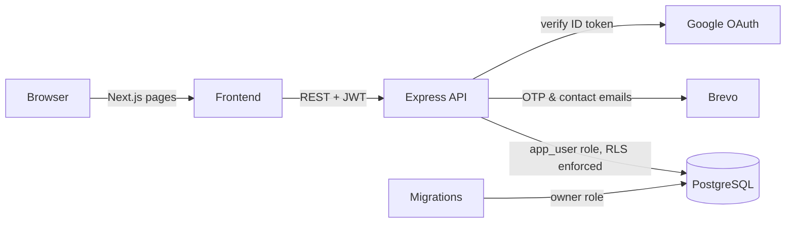

# RooMates

**Split rent, bills & trip expenses with roommates — and settle up in the fewest payments.**

RooMates is a multi-tenant expense splitter. Create a room for your flat or a trip, add shared expenses, split them equally or with custom shares, and RooMates tells everyone exactly who owes whom using a debt-simplification algorithm that minimises the number of payments.

Built as a full-stack project with a focus on the parts that are easy to get wrong: database-level tenant isolation, secure session handling, money arithmetic and abuse protection.

---

## Highlights

- **Debt simplification** — a greedy algorithm settles *n* people in at most *n − 1* payments, instead of everyone paying everyone. Unit-tested with Jest.
- **Database-enforced isolation** — PostgreSQL Row-Level Security restricts every room's data to its members. Even a buggy query can't leak another room's expenses.
- **Secure auth** — email + password or Google sign-in; short-lived JWT access tokens with rotated, hashed refresh tokens; email OTP verification and password reset.
- **Abuse protection** — per-IP and per-account rate limiting, plus login throttling that slows down password-guessing scripts.
- **Correct money handling** — all amounts stored as integer paise; uneven splits distribute leftover paise so totals always match exactly.
- **SEO-ready public site** — statically rendered home, blog, about and contact pages with per-page metadata, sitemap, robots.txt and structured data.

## How settle-up works

Three roommates paid ₹1,150, ₹1,390 and ₹1,765 over a month. The fair share is ₹1,435 each:

| Person | Paid | Net balance |
|---|---|---|
| Aman | ₹1,150 | owes ₹285 |
| Bhavya | ₹1,390 | owes ₹45 |
| Chirag | ₹1,765 | gets ₹330 |

RooMates settles this in **2 payments**: Aman → Chirag ₹285, Bhavya → Chirag ₹45.

The algorithm computes one net balance per person, then repeatedly matches the largest debtor with the largest creditor until everyone is at zero (`O(n log n)`). Finding the *provably* minimum number of payments for arbitrary balances is NP-hard, so greedy is the deliberate, predictable trade-off. See [`settlement.algorithm.ts`](Backend/src/modules/settlement/settlement.algorithm.ts).

## Tech stack

| Layer | Tools |
|---|---|
| Frontend | Next.js 16 (App Router), React 19, TypeScript, Tailwind CSS v4, Zustand, lucide-react |
| Backend | Node.js, Express 5, TypeScript, Zod, Winston + Morgan |
| Database | PostgreSQL (Neon) with Row-Level Security, node-pg-migrate |
| Auth | JWT access + refresh tokens, bcrypt, Google OAuth (ID-token verification), email OTP |
| Email | Brevo (transactional API) |
| Security | express-rate-limit, express-slow-down |
| Docs & tests | OpenAPI generated from Zod schemas + Swagger UI, Jest |

## Architecture



### Security design notes

- **Two database roles.** Migrations run as the table owner; the API connects as a separate least-privilege `app_user`. Postgres table owners silently bypass RLS, so connecting as the owner would make every policy decorative.
- **Membership-based RLS, not a flat `tenant_id`.** A room is shared across users from different accounts, so access is decided by room membership. Each request runs in a transaction with `SET LOCAL app.current_user_id`, which the policies read.
- **Narrow `SECURITY DEFINER` functions** handle the few operations that must happen before the caller's identity is known: sign-up, email lookup for login, joining a room by invite code, and billing quota counts. They also avoid the infinite recursion a self-referencing `room_members` policy would cause.
- **IDs are generated in the application**, because `INSERT … RETURNING` is also checked against the SELECT policy, which a freshly created row can't pass yet.
- **Refresh tokens and OTP codes are stored only as SHA-256 hashes.** Refresh tokens rotate on every use and all sessions are revoked on password reset. OTPs expire after 10 minutes and lock after 5 wrong guesses.
- **Rate limits** use a per-account limiter as well as per-IP limits, since an attacker can spread guesses for one account across many IPs.

## Features

- Sign up with email (OTP-verified) or Google; forgot/reset password via emailed code
- 3-step onboarding (profile → first room → invite roommates); a unique mobile number is required to limit free-tier abuse via throwaway emails
- Rooms for flatmates (recurring) or trips (one-off), joined via an 8-character invite code
- Free plan limited to 2 rooms per account, enforced server-side
- Expenses with equal or custom splits
- Live balances per member and a simplified settle-up plan
- Public marketing site: home, about, blog, contact form, terms, privacy

## API

Interactive docs are served at **`/api-docs`** (raw spec at `/api-docs.json`) when the backend is running.

| Method | Endpoint | Description |
|---|---|---|
| POST | `/api/auth/signup` | Create account, email a verification code |
| POST | `/api/auth/verify-email` | Confirm code, sign in |
| POST | `/api/auth/resend-verification` | Resend verification code |
| POST | `/api/auth/login` | Email + password sign in |
| POST | `/api/auth/google` | Google sign in |
| POST | `/api/auth/forgot-password` | Email a password-reset code |
| POST | `/api/auth/reset-password` | Set new password with code, sign in |
| POST | `/api/auth/refresh` | Rotate refresh token, get new access token |
| POST | `/api/auth/logout` | Revoke refresh token |
| POST | `/api/users/me/onboarding` | Complete onboarding |
| GET / POST | `/api/rooms` | List my rooms / create a room |
| POST | `/api/rooms/join` | Join a room by invite code |
| GET | `/api/rooms/:roomId` | Room details |
| GET | `/api/rooms/:roomId/members` | Room members |
| GET / POST | `/api/rooms/:roomId/expenses` | List / add expenses |
| GET | `/api/rooms/:roomId/balances` | Net balances + settle-up plan |
| POST | `/api/contact` | Contact form |
| GET | `/api/health` | Health + database check |

## Getting started

### Prerequisites

- Node.js 20+
- A PostgreSQL database (a free [Neon](https://neon.tech) project works; the migrations assume the database is named `neondb`)
- A [Brevo](https://www.brevo.com) API key and a verified sender address for emails (free plan: 300/day)
- A Google OAuth client ID (optional — only needed for "Sign in with Google")

### Backend

```bash
cd Backend
npm install
cp .env.example .env      # then fill in the values below
npm run migrate:up        # creates tables, RLS policies and the app_user role
npm run dev               # http://localhost:5000
```

| Variable | Purpose |
|---|---|
| `DATABASE_URL` | Owner connection — used **only** by migrations |
| `APP_DB_PASSWORD` | Password the migrations set for the `app_user` role |
| `APP_DATABASE_URL` | `app_user` connection — used by the running API |
| `JWT_SECRET` | Secret for signing access tokens |
| `ACCESS_TOKEN_EXPIRES_IN` / `REFRESH_TOKEN_EXPIRES_DAYS` | Token lifetimes (default `15m` / `30`) |
| `CORS_ORIGIN` | Frontend URL, e.g. `http://localhost:3000` |
| `GOOGLE_CLIENT_ID` | Google OAuth client ID |
| `BREVO_API_KEY` | Brevo API key (`xkeysib-…`, from *SMTP & API → API keys*) |
| `EMAIL_FROM_NAME` / `EMAIL_FROM_ADDRESS` | Sender shown on emails — the address must be a verified Brevo sender |
| `CONTACT_INBOX` | Where contact-form messages are delivered |
| `TRUST_PROXY` | Number of reverse proxies in front of the API (`0` locally, usually `1` in production) |

> Brevo lets you send from a single verified address without owning a domain. Without domain authentication, some emails may land in spam — authenticate a domain in Brevo for better deliverability.

### Frontend

```bash
cd Frontend
npm install
cp .env.example .env      # set NEXT_PUBLIC_API_URL, NEXT_PUBLIC_SITE_URL, NEXT_PUBLIC_GOOGLE_CLIENT_ID
npm run dev               # http://localhost:3000
```

### Tests

```bash
cd Backend
npm test
```

## Project structure

```
Backend/
  migrations/            SQL schema, RLS policies, SECURITY DEFINER functions
  src/
    config/              env validation, db pool + user context, logger, email, OpenAPI
    middlewares/         auth, error handling, request logging, rate limiting
    modules/             auth, users, rooms, expenses, settlement, contact
                         (each: routes -> controller -> service -> schema)
Frontend/
  src/
    app/(marketing)/     public SEO pages: home, about, blog, contact, terms, privacy
    app/                 sign in/up, verify, reset, onboarding, dashboard, rooms
    components/ui/       reusable form and layout components
    lib/                 API client with automatic token refresh, auth hooks, SEO helpers
    content/             blog posts
```

## Code review

A full review of the codebase — findings, fixes, Zustand usage and known trade-offs — is in [`docs/CODE_REVIEW.md`](docs/CODE_REVIEW.md).

## Roadmap

- [ ] Razorpay subscriptions for unlimited rooms (idempotent webhook handling via a queue)
- [ ] Redis caching for balances, and a shared Redis store for rate limits
- [ ] Real-time updates with Socket.io
- [ ] Activity log per room
- [ ] Super-admin dashboard
- [ ] Room vacancy listings for nearby users

## Author

**Kamran Alam**
